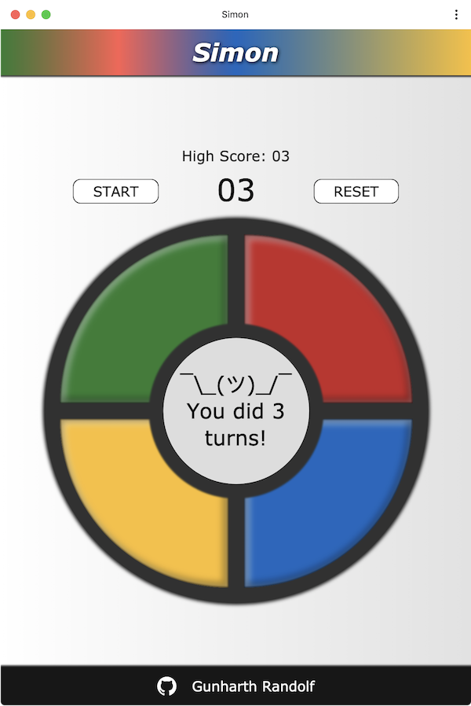

# Simon-Game
Web component & PWA

## Features
- uses Laravel-Mix webpack wrapper for compilation and minification
- developed as a web component
- 100% PWA ready
- extra installation feature for latest Chrome browsers
- auto deployment for https://simon.gunicode.com through Netlify
- high score saved to local storage
- for test purpose the maximum rounds are set to 5. You can change this in the simon-game.js file under game settings

## Screenshot


## Lighthouse Report


## Installation
Clone the repository
```
git clone git@github.com:gunharth/Simon-Game.git
````
cd into the directory
```
cd Simon-Game
````
Install dependencies
```
npm install
```
Start the server on localhost:3000
```
npm start
```

## Development
Compile src to public folder
```
npm run dev
```
Start BrowserSync and listen to changes
Note: Keep dev tools open and disable cache in Chrome dev tools under the Network tab to help cache busting
```
npm run watch
```
Compile and minify assets ready for production
```
npm run prod
```

## Todos & notes
- Next time use https://developers.google.com/web/tools/workbox/
- Redo the app with stencil
- audio delay. especially on iOS there's a terrible delay which there might not even be a solution for.
